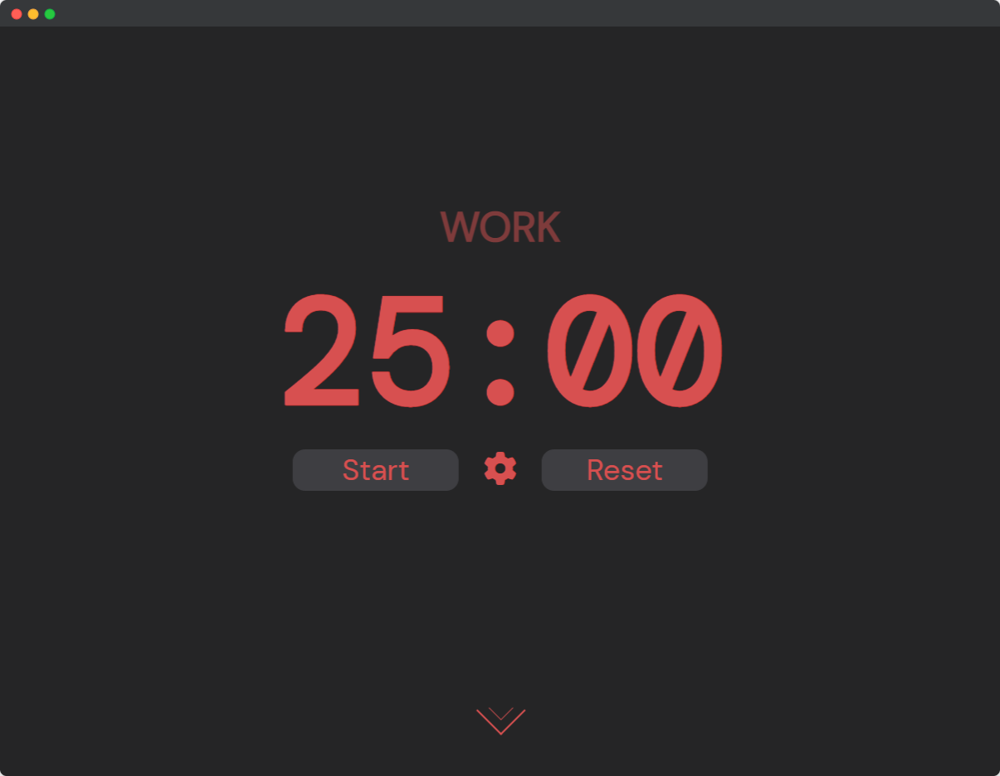

  </img>

<h3 align="center">Tomatera is an automatic pomodoro timer.</h3>

  The <a href="https://en.wikipedia.org/wiki/Pomodoro_Technique">pomodoro technique</a> is a method of time management through intervals.
   
  By taking routine breaks, you stay <b>motivated</b> and therefore more <b>productive</b>.
   
  <b>Tomatera</b> aims to help you use the technique by automatically switching between 25 minute and 5 minute work/break timers.
    
  Try it out at <a href="https://tomatera.dev">tomatera.dev</a>!

## About the Project

  </img>

  <b>Tomatera</b> started as a web development learning experience, but now aims to be a high quality pomodoro timer for anyone to use.
  Built with Vite and React by a student for students, <b>Tomatera</b> is defined by functionality and minimalism.
    
  Fun Fact: <b>Tomatera</b> is named after the Spanish translation for "tomato plant", which is inspired by <i>pomodoro</i> being the Italian translation for "tomato"!

## Roadmap

- [x] Automate timer starting
- [x] Add satisfying sounds
- [x] Add a descriptive footer
- [ ] Options menu
  - [ ] Customizable intervals
  - [ ] Mute button
  - [ ] Light/dark mode switch
- [ ] Backend
  - [ ] User authentication
  - [ ] Point system
  - [ ] Leaderboards
