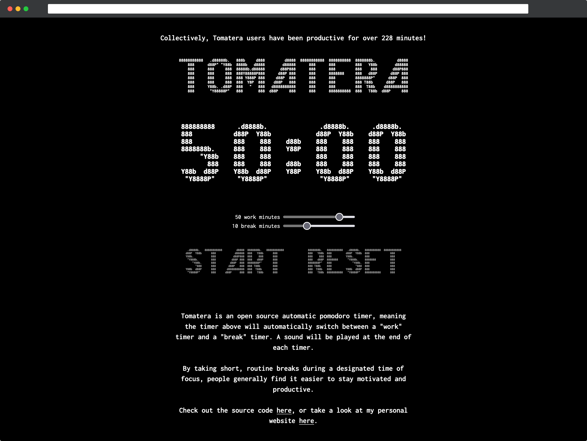
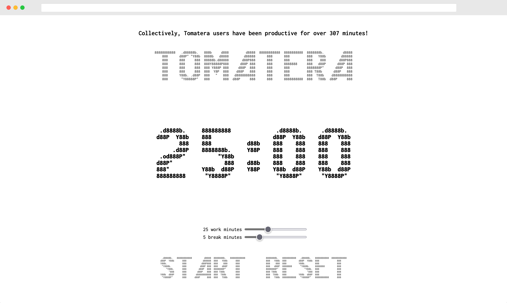

# tomatera.dev

## About the Project

  
  
    

TODO:

- [ ] Add indicator of which timer (work or break) is active
- [ ] User authentification (keep productivity stats of individual users)
- [ ] Productivity time leaderboards
- [ ] Redesign spacing of page elements (timer should be the only thing on the screen unless you scroll down)

## Contributing

Contributions are what make the open source community such an amazing place to learn, inspire, and create. Any contributions you make are **greatly appreciated**.

If you have a suggestion that would make this better, please fork the repo and create a pull request. You can also simply open an issue with the tag "enhancement". Don't forget to give the project a star! Thanks again!

1. Fork this repo.
2. Create your branch with `git checkout -b branchname`.
3. Commit your changes with `git commit -m "Your message here!"`.
4. Push to the branch with `git push origin branchname`.
5. Open a pull request!

## License

Distributed under the MIT License. See `LICENSE` for more information.
